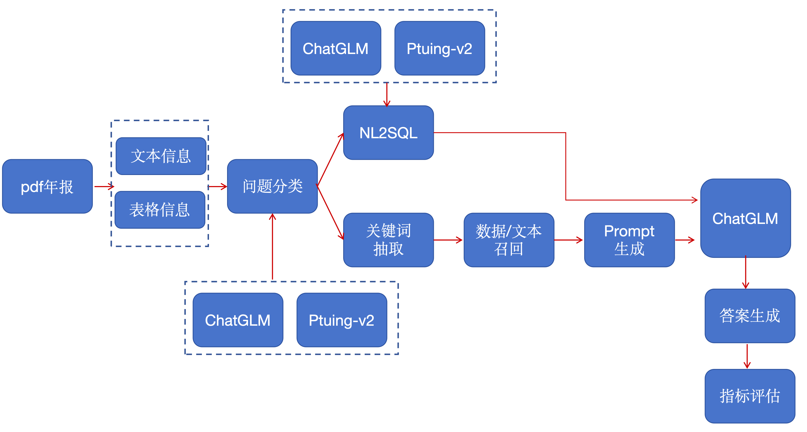
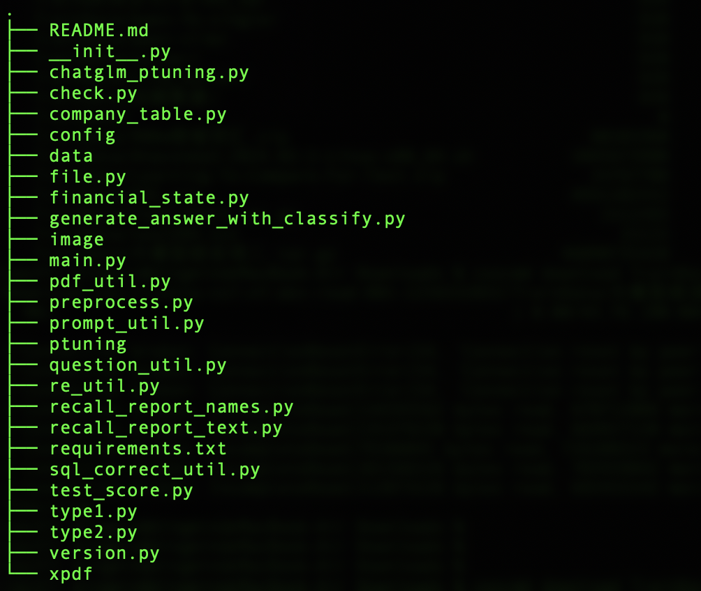
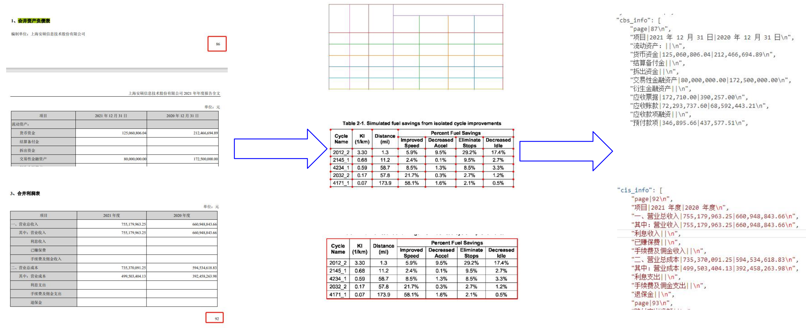

# FindMind: LLM-based Financial QA System

## 1. Project Overview

FindMind is a large-language-model-centered financial QA system built to answer questions from listed-company annual reports. The dataset contains 11,588 real annual reports from 2019 to 2021.

The project goal is to build a deep annual-report understanding assistant that can support practical finance workflows (for example, stock-investment QA and industry analysis assistance). It focuses on handling financial terminology, implicit context, and multi-step reasoning over semi-structured report data.

The target capability is organized into three levels:

- **Level 1: Basic fact lookup**  
  Questions that can be answered directly from annual reports.
- **Level 2: Statistical/computational QA**  
  Questions that require calculation or indicator comparison.
- **Level 3: Open-ended analysis**  
  Questions that require summarization, interpretation, and analysis.

Example outputs and target capability illustrations (English text version):

- **Fact lookup**: "What is Company A's foreign-language name in 2019?"
- **Computation**: "What is Company B's debt-to-asset ratio in 2020? Keep two decimal places."
- **Analysis**: "Describe the operating performance trend of Company C in 2021."

---

## 2. Data Description

### Knowledge Base

- 11,588 listed-company annual reports (2019–2021)
- Total corpus size: about 70 GB

### Evaluation Task

Given reference documents and a user question, the model must generate answers in the required format. The test set includes 1,000 questions across multiple task types.

Sample questions:

```json
{"ID": 1, "question": "How much was ICBC's financial expense in 2019 (in CNY)?"}
{"ID": 2, "question": "What were ICBC's non-operating expense and non-operating income in 2019 (in CNY)?"}
{"ID": 3, "question": "What was ICBC's net profit growth rate in 2021? Keep two decimal places."}
```

---

## 3. Evaluation Metrics

The scoring pipeline combines:

1. format correctness,
2. key-field coverage,
3. semantic similarity to candidate references.

A simplified scoring view (English text version):

```text
final_score = 0.25 * format_score + 0.25 * key_field_score + 0.50 * semantic_similarity
```

Similarity-based scoring example:

- prediction: `ICBC's 2019 financial expense is 12,345,678.90 CNY.`
- top similar references are ranked by similarity score
- final score combines field checks + weighted similarity

---

## 4. Main Challenges

1. The test set covers diverse question types (lookup, calculation, analysis), so one single strategy is often insufficient.
2. Annual-report PDFs are highly heterogeneous and hard to normalize.
3. High-quality supervised fine-tuning data is expensive to label manually.
4. LLM generation can be unstable, making strict output formatting difficult.

---

## 5. Solution Architecture



---

## 6. Code Structure



---

## 7. Pipeline: PDF Parsing and Information Extraction

Annual reports contain many critical tables (balance sheet, income statement, cash-flow statement). The system extracts report content and stores structured outputs in a relational format.

For easier downstream querying, extracted relational data (basic company info + table fields) is assembled into one wide table with one row per company/year.

Main extraction steps:

- **PDF text extraction**: `pdf2text`
- **Page recall**: keyword-based page location by report/table names
- **Table extraction**: `camelot-py`
- **Filtering**: exclude non-consolidated or irrelevant report variants

Core implementation is in `preprocess.py`:

- `extract_pdf_text()`: extract report text
- `extract_pdf_tables()`: extract key tables and profile fields



---

## 8. Pipeline: Question Classification

Accurate answering starts with intent understanding. Different question types are routed to different answer strategies.

The project trains a classifier (LoRA / P-Tuning) for automatic question categorization:

1. generate few-shot in-context data,
2. manually validate and clean,
3. fine-tune a classifier,
4. classify incoming user questions before answer generation.

Classification categories and prompts are defined and optimized for annual-report QA.

Example mapping from question to type (English text version):

- `What is the balance of Company A?` -> **Type D**
- `What is Company A's debt-to-asset ratio in 2020? Keep two decimal places.` -> **Type D**
- `Please provide detailed data for Company B's other current assets in 2021.` -> **Type C**
- `Please describe the analysis of Company C's main shareholding subsidiaries in 2019.` -> **Type F**
- `Which listed company ranked 7th in total liabilities in 2019?` -> **Type E**
- `What is Company D's foreign-language name in 2019?` -> **Type A**

Key locations:

- fine-tuning script: `./ptuning/CLASSIFY_PTUING/train.sh`
- online prediction flow: `main.py`, `generate_answer_with_classify.py`

---

## 9. Pipeline: NL2SQL Generation

For statistical queries, NL2SQL quality strongly depends on task-specific training data. This project emphasizes domain-specific dataset construction for real annual-report retrieval scenarios, instead of relying only on generic public datasets.

---

## 10. Quick Start

1. Install dependencies:

```bash
pip install -r requirements.txt
```

2. Prepare data and configuration (model paths, report files, intermediate directories).
3. Run the main pipeline:

```bash
python main.py
```

4. Run a lightweight sample-data smoke test (no model checkpoints required):

```bash
python main.py --sample
```


5. Optional LoRA entry:

```bash
python lora_main.py
```

---

## 11. Repository Highlights

- `main.py` / `lora_main.py`: end-to-end orchestration
- `preprocess.py`: PDF parsing + extraction
- `generate_answer_with_classify.py`: answer generation workflow
- `question_util.py`: question normalization and year/company parsing
- `prompt_util.py`: prompt templates
- `sql_correct_util.py`: SQL post-correction
- `test_score.py`: evaluation and scoring utilities
